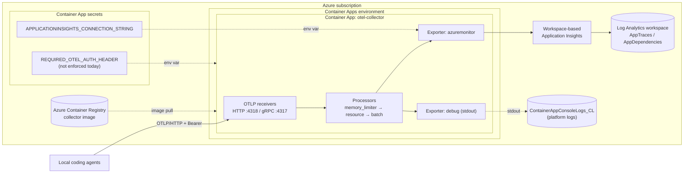

# OTEL2Sentinel

OTEL2Sentinel is a simple, single-tenant project that forwards OpenTelemetry data from local coding agents into Azure Monitor through a collector running in Azure Container Apps.

## Goal

Create a minimal setup with:

- Azure Container Apps environment
- Container App hosting the OpenTelemetry Collector
- Azure Container Registry for the collector image
- Workspace-based Application Insights connected to Log Analytics
- Source config examples for VS Code Copilot, Claude Code, Claude Cowork, and Office agents

## Architecture

1. Local agents export OTLP telemetry over HTTPS.
2. Collector runs in Azure Container Apps and receives OTLP on HTTP (4318) and gRPC (4317).
3. Collector exports to workspace-based Application Insights.
4. Data is available through Application Insights and Log Analytics.



### Auth handling (for future reference)

- Sources are configured to send `Authorization=Bearer <shared-secret>` in `OTEL_EXPORTER_OTLP_HEADERS` as a client-side contract.
- Deployment stores the shared token on the Container App as the `auth-header` secret and exposes it to the collector container as `REQUIRED_OTEL_AUTH_HEADER` for future use.
- Collector-side bearer auth is **not** enforced in [collector/collector-config.yaml](collector/collector-config.yaml). The current config exposes OTLP receivers without an `auth` block.
- Collector-side enforcement is left off by default for deploy-time convenience. VS Code Copilot **can** send the bearer header via `OTEL_EXPORTER_OTLP_HEADERS` (see the official [Monitor agent usage with OpenTelemetry](https://code.visualstudio.com/docs/copilot/guides/monitoring-agents) guide). See [SETUP.MD](SETUP.MD) for the pass-2 enforcement path.

## Repository structure

- [collector/](collector): collector Docker image and runtime config
- [infra/cli/](infra/cli): Azure CLI deployment scripts (PowerShell)
- [docs/](docs): admin runbook and implementation guidance
- [env/](env): source agent env and settings templates

## Quick start

### 1. Prerequisites

- Azure CLI
- PowerShell 7+
- Access to an Azure subscription where you can create monitoring and container resources

### 2. Deploy all infrastructure and collector

Run from repository root:

```powershell
./infra/cli/deploy-all.ps1 -SubscriptionId "<subscription-guid>" -Location "westeurope" -ResourceGroupName "rg-otel2sentinel-dev" -LogAnalyticsWorkspaceName "law-otel2sentinel-dev" -AppInsightsName "appi-otel2sentinel-dev" -AcrName "acrotel2sentineldev" -ContainerAppsEnvironmentName "cae-otel2sentinel-dev" -CollectorAppName "ca-otel-collector-dev" -CollectorAuthHeaderValue "<shared-secret>" -ImageTag "v1"
```

### 3. Configure clients

Use templates:

- [.vscode/settings.json](.vscode/settings.json) for workspace-level VS Code telemetry wiring
- [env/example.vscode.env](env/example.vscode.env)
- [env/example.claude.env](env/example.claude.env)
- [env/settings.vscode.sample.json](env/settings.vscode.sample.json)
- [env/settings.claude.sample.json](env/settings.claude.sample.json)

Detailed guidance is in [docs/source-agent-config-vscode.md](docs/source-agent-config-vscode.md), [docs/source-agent-config-claude.md](docs/source-agent-config-claude.md), [docs/source-agent-config-claude-cowork.md](docs/source-agent-config-claude-cowork.md), and [docs/source-agent-config-office-agents.md](docs/source-agent-config-office-agents.md).

### 4. Validate

```powershell
./infra/cli/06-verify-telemetry.ps1 -ResourceGroupName "rg-otel2sentinel-dev" -CollectorAppName "ca-otel-collector-dev"
```

Optional smoke test from a local machine:

```powershell
./infra/cli/07-send-synthetic-otlp.ps1 -CollectorBaseUrl "https://<collector-fqdn>" -AuthHeaderValue "<shared-secret>"
```

## Expected Log Analytics tables (logs-only mode)

When this repo runs in logs-only mode, telemetry about user prompts/messages, agent behavior, and tool executions should land in:

- `AppTraces` (primary table for OTEL logs exported through Application Insights)
- `AppDependencies` (expected for tool/function execution spans, for example `execute_tool run_in_terminal`)

Tables that should not be populated by this collector pipeline for metrics/traces in logs-only mode:

- `AppMetrics`
- `AppRequests` (unless another source sends request telemetry)
- `AppExceptions` (unless a source emits exception telemetry)

Note: Azure platform/runtime data for Container Apps can still appear in platform tables (for example `ContainerAppConsoleLogs_CL`). Those are infrastructure logs, not the agent OTEL logs.

Example KQL for recent agent and tool activity:

```kusto
let since = ago(1h);
let traceEvents =
	AppTraces
	| where TimeGenerated > since
	| where Message has_any ("tool.call", "agent.turn", "copilot_chat")
	| project TimeGenerated, Table="AppTraces", Signal="log", Name=tostring(Message), Success=bool(null), DurationMs=real(null), Properties;
let toolEvents =
	AppDependencies
	| where TimeGenerated > since
	| where Name startswith "execute_tool" or tostring(Properties["gen_ai.operation.name"]) == "execute_tool"
	| project TimeGenerated, Table="AppDependencies", Signal="tool", Name, Success, DurationMs, Properties;
union traceEvents, toolEvents
| order by TimeGenerated desc
```

Included telemetry in this setup:

- Session lifecycle and turn events (for example `copilot_chat.session.start` and `copilot_chat.agent.turn`)
- Tool call events (for example `copilot_chat.tool.call` with tool name, success flag, and duration)
- Tool execution spans represented as dependencies (for example `execute_tool run_in_terminal` in `AppDependencies`)
- Operational metadata in `Properties` (for example `event.name`, `session.id`, `gen_ai.tool.name`, `duration_ms`, token counts, and status fields)

Important: this is source-driven telemetry. The collector forwards what the source emits.

Privacy and security warning: avoid passing secrets on command lines in telemetry-enabled sessions. Command arguments can be captured in tool-call telemetry.

## Content capture (`captureContent`) for VS Code Copilot

The VS Code Copilot OTel integration is controlled by `github.copilot.chat.otel.captureContent` (or `COPILOT_OTEL_CAPTURE_CONTENT=true`). It is **off by default** and this repo's templates keep it off.

- **Disabled (default):** only metadata is exported — model names, token counts, durations, tool names, success/error status. No prompt or response text, no tool arguments, no tool results.
- **Enabled:** full prompt messages, response messages, system prompts, tool schemas, tool arguments, and tool results are populated on span attributes such as `gen_ai.input.messages`, `gen_ai.output.messages`, `gen_ai.tool.call.arguments`, and `gen_ai.tool.call.result`.

Enabling content capture means file contents, code snippets, and anything pasted into chat can land in Application Insights. Only enable it in trusted environments, and consider setting `github.copilot.chat.otel.maxAttributeSizeChars` to bound per-attribute size.

Reference: <https://code.visualstudio.com/docs/copilot/guides/monitoring-agents#_content-capture>

## Image strategy

This scaffold supports two options:

1. Custom image (default): [collector/Dockerfile](collector/Dockerfile) and [collector/collector-config.yaml](collector/collector-config.yaml), built in ACR Tasks.
2. Upstream image path: use `otel/opentelemetry-collector-contrib` directly and provide config externally.

## Additional docs

- [SETUP.MD](SETUP.MD)
- [docs/vscode-byok-language-models.md](docs/vscode-byok-language-models.md)
- [docs/source-agent-config-vscode.md](docs/source-agent-config-vscode.md)
- [docs/source-agent-config-claude.md](docs/source-agent-config-claude.md)
- [docs/source-agent-config-claude-cowork.md](docs/source-agent-config-claude-cowork.md)
- [docs/source-agent-config-office-agents.md](docs/source-agent-config-office-agents.md)

## Other options

You could forego the custom collector and just use the built in Azure Monitor Application Insights OTel support:


Read more: [Introduction to Application Insights - OpenTelemetry observability.](https://learn.microsoft.com/en-gb/azure/azure-monitor/app/app-insights-overview?tabs=webapps#getting-started)