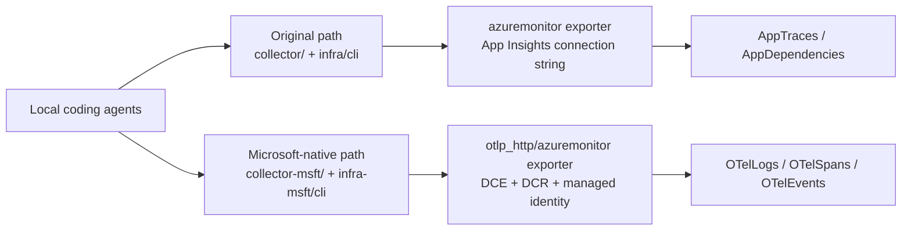
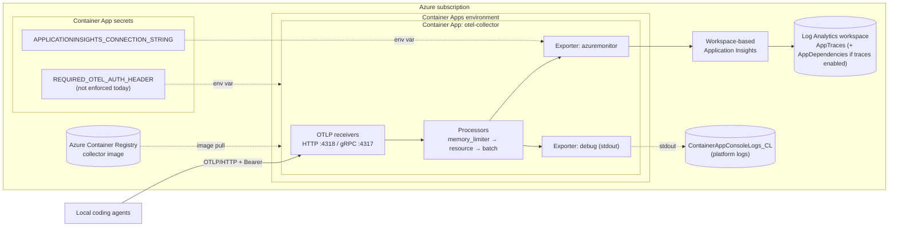

# OTEL2Sentinel

OTEL2Sentinel is a simple, single-tenant project that forwards OpenTelemetry data from local coding agents into Azure Monitor through a collector running in Azure Container Apps.

## Goal

Create a minimal setup with:

- Azure Container Apps environment
- Container App hosting the OpenTelemetry Collector
- Azure Container Registry for the collector image
- Azure Monitor destination using one of two supported paths:
    - workspace-based Application Insights connected to Log Analytics
    - Microsoft-native OTLP ingestion through a Data Collection Endpoint and Data Collection Rule
- Source config examples for VS Code Copilot, Claude Code, Claude Cowork, and Office agents

## Two supported paths

This repository supports two ways to get agent OTLP data into Azure Monitor. Both start the same way, with local agents sending OTLP to a collector running in Azure Container Apps. The difference is the collector's Azure-side exporter, auth model, and the tables you query afterward.

| Path | Use when | Collector and infra | Azure-side auth | Query surface |
| --- | --- | --- | --- | --- |
| Original App Insights path | You want the simpler path and existing Application Insights-style queries | [collector/](collector) and [infra/cli/](infra/cli) | Application Insights connection string stored on the Container App | `AppTraces`, `AppDependencies`, and other App Insights tables |
| Microsoft-native OTLP path | You want the newer Azure Monitor OTLP ingestion model and OTel semantic tables | [collector-msft/](collector-msft) and [infra-msft/cli/](infra-msft/cli) | System-assigned managed identity with DCR RBAC | `OTelLogs`, `OTelSpans`, `OTelEvents` |



In practice, the split is straightforward:

- Choose the OG (collector/infra) path if you want the lowest-friction setup and you are happy querying Application Insights-backed tables.
- Choose the updated (collector-msft/infra-msft) path if you want Azure Monitor's newer OTLP ingestion flow, Entra-based auth, and OTel semantic tables.
- Source-side configuration is mostly the same either way. The main change is after the collector receives the data.

## Original path architecture

The detailed diagram below shows the original App Insights-based path used by [collector/](collector) and [infra/cli/](infra/cli). The Microsoft-native variant swaps the exporter and destination as shown in the comparison diagram above.

1. Local agents export OTLP telemetry over HTTPS.
2. Collector runs in Azure Container Apps and receives OTLP on HTTP (4318) and gRPC (4317).
3. Collector exports to workspace-based Application Insights.
4. Data is available through Application Insights and Log Analytics.



### Auth handling (for future reference)

- Sources are configured to send `Authorization=Bearer <shared-secret>` in `OTEL_EXPORTER_OTLP_HEADERS` as a client-side contract.
- Deployment stores the shared token on the Container App as the `auth-header` secret and exposes it to the collector container as `REQUIRED_OTEL_AUTH_HEADER` for future use.
- Collector-side bearer auth is **not** enforced in [collector/collector-config.yaml](collector/collector-config.yaml). The current config exposes OTLP receivers without an `auth` block.
- Collector-side enforcement is left off by default for deploy-time convenience. VS Code Copilot **can** send the bearer header via `OTEL_EXPORTER_OTLP_HEADERS` (see the official [Monitor agent usage with OpenTelemetry](https://code.visualstudio.com/docs/copilot/guides/monitoring-agents) guide). See [SETUP.MD](SETUP.MD) for the pass-2 enforcement path.

## Repository structure

- [collector/](collector): collector Docker image and runtime config (original path: `azuremonitor` exporter + App Insights connection string)
- [collector-msft/](collector-msft): Microsoft-native OTLP variant (`otlp_http/azuremonitor` exporter + Entra auth via system-assigned managed identity against a DCR). See [SETUP.MD](SETUP.MD#microsoft-native-otlp-variant-side-by-side).
- [infra/cli/](infra/cli): Azure CLI deployment scripts (PowerShell) for the original collector
- [infra-msft/cli/](infra-msft/cli): deployment scripts for the Microsoft-native variant. Reuses `infra/cli/01`, `03`, `04`.
- [docs/](docs): admin runbook and implementation guidance
- [env/](env): source agent env and settings templates

## Quick start

### 1. Prerequisites

- Azure CLI
- PowerShell 7+
- Access to an Azure subscription where you can create monitoring and container resources

### 2. Pick a deployment path

Choose one path before you deploy:

- Original App Insights path: use [collector/](collector) with [infra/cli/](infra/cli).
- Microsoft-native OTLP path: use [collector-msft/](collector-msft) with [infra-msft/cli/](infra-msft/cli).

### 3. Deploy infrastructure and collector

#### Original App Insights path

If some of the resources already exist (like `ResourceGroup` and `LogAnalyticsWorkspace`) just provide them instead of the generic names given here. If a resource is found the script *should* recognize it and just use it instead of deploying a new one. You can also just deploy the stack as a standalone collector.

Run from repository root:

```powershell
./infra/cli/deploy-all.ps1 -SubscriptionId "<subscription-guid>" -Location "westeurope" -ResourceGroupName "rg-otel2sentinel-dev" -LogAnalyticsWorkspaceName "law-otel2sentinel-dev" -AppInsightsName "appi-otel2sentinel-dev" -AcrName "acrotel2sentineldev" -ContainerAppsEnvironmentName "cae-otel2sentinel-dev" -CollectorAppName "ca-otel-collector-dev" -CollectorAuthHeaderValue "<shared-secret>" -ImageTag "v1"
```

#### Microsoft-native OTLP path

Create the Azure Monitor OTLP destination first. The supported choices are:

1. Create a new Application Insights resource with `OTLP support` set to `On` and copy the generated DCR resource ID plus the logs, traces, and metrics OTLP endpoints.
2. Create the DCE and DCR yourself and capture the same values.

Then deploy the Microsoft-native variant:

```powershell
./infra-msft/cli/deploy-all-msft.ps1 -SubscriptionId "<subscription-guid>" -Location "westeurope" -ResourceGroupName "rg-otel2sentinel-msft" -LogAnalyticsWorkspaceName "law-otel2sentinel-msft" -AcrName "acrotel2sentinelmsft" -ContainerAppsEnvironmentName "cae-otel2sentinel-msft" -CollectorAppName "ca-otel-collector-msft" -DcrResourceId "/subscriptions/<sub>/resourceGroups/<rg>/providers/Microsoft.Insights/dataCollectionRules/<dcr>" -OtlpLogsEndpoint "<exact-logs-endpoint-url>" -OtlpTracesEndpoint "<exact-traces-endpoint-url>" -OtlpMetricsEndpoint "<exact-metrics-endpoint-url>" -ImageTag "v1"
```

More detail on this path is in [SETUP.MD](SETUP.MD#microsoft-native-otlp-variant-side-by-side).

### 4. Configure clients

Use templates:

- [.vscode/settings.json](.vscode/settings.json) for workspace-level VS Code telemetry wiring
- [env/example.vscode.env](env/example.vscode.env)
- [env/example.claude.env](env/example.claude.env)
- [env/settings.vscode.sample.json](env/settings.vscode.sample.json)
- [env/settings.claude.sample.json](env/settings.claude.sample.json)

Detailed guidance is in [docs/source-agent-config-vscode.md](docs/source-agent-config-vscode.md), [docs/source-agent-config-claude.md](docs/source-agent-config-claude.md), [docs/source-agent-config-claude-cowork.md](docs/source-agent-config-claude-cowork.md), and [docs/source-agent-config-office-agents.md](docs/source-agent-config-office-agents.md).

### 5. Validate

Validate the path you deployed:

Original App Insights path:

```powershell
./infra/cli/06-verify-telemetry.ps1 -ResourceGroupName "rg-otel2sentinel-dev" -CollectorAppName "ca-otel-collector-dev"
```

Microsoft-native OTLP path:

```powershell
./infra-msft/cli/07-verify-telemetry-otlp.ps1 -ResourceGroupName "rg-otel2sentinel-msft" -CollectorAppName "ca-otel-collector-msft" -LogAnalyticsWorkspaceName "law-otel2sentinel-msft"
```

Optional smoke test from a local machine for either path:

```powershell
./infra/cli/07-send-synthetic-otlp.ps1 -CollectorBaseUrl "https://<collector-fqdn>" -AuthHeaderValue "<shared-secret>"
```

## Expected Log Analytics tables for the original App Insights path (logs-only mode)

When this repo runs in its default logs-only mode, telemetry about user prompts/messages, agent behavior, and tool-call events should land in:

- `AppTraces` (primary table for OTEL logs exported through Application Insights)

In the current default config, `AppDependencies` is not expected because the collector does not define a traces pipeline. If you add a traces pipeline later, internal/client spans such as `execute_tool ...` can show up there.

Tables that should not be populated by the default collector config:

- `AppDependencies` (unless you enable a traces pipeline)
- `AppMetrics`
- `AppRequests` (unless another source sends request telemetry or you enable traces for server/consumer spans)
- `AppExceptions` (unless a source emits exception telemetry)

Note: Azure platform/runtime data for Container Apps can still appear in platform tables (for example `ContainerAppConsoleLogs_CL`). Those are infrastructure logs, not the agent OTEL logs.

Example KQL for recent agent activity in the default logs-only config:

```kusto
let since = ago(1h);
AppTraces
| where TimeGenerated > since
| where Message has_any ("tool.call", "agent.turn", "copilot_chat")
| project TimeGenerated, Table="AppTraces", Signal="log", Name=tostring(Message), Properties
| order by TimeGenerated desc
```

Included telemetry in this default setup:

- Session lifecycle and turn events (for example `copilot_chat.session.start` and `copilot_chat.agent.turn`)
- Tool call events (for example `copilot_chat.tool.call` with tool name, success flag, and duration)
- Operational metadata in `Properties` (for example `event.name`, `session.id`, `gen_ai.tool.name`, `duration_ms`, token counts, and status fields)
- If you enable a traces pipeline, tool execution spans can appear as dependencies (for example `execute_tool run_in_terminal` in `AppDependencies`)

Important: this is source-driven telemetry. The collector forwards what the source emits.

Privacy and security warning: avoid passing secrets on command lines in telemetry-enabled sessions. Command arguments can be captured in tool-call telemetry.

## Expected tables for the Microsoft-native OTLP path

If you deploy the Microsoft-native variant, the collector writes to Azure Monitor's OTel semantic tables instead of the Application Insights tables above.

- `OTelLogs`
- `OTelSpans`
- `OTelEvents`

Example KQL:

```kusto
OTelLogs
| take 50

OTelSpans
| take 50

OTelEvents
| take 50
```

## Content capture (`captureContent`) for VS Code Copilot

The VS Code Copilot OTel integration is controlled by `github.copilot.chat.otel.captureContent` (or `COPILOT_OTEL_CAPTURE_CONTENT=true`). It is **off by default** and this repo's templates keep it off.

- **Disabled (default):** only metadata is exported — model names, token counts, durations, tool names, success/error status. No prompt or response text, no tool arguments, no tool results.
- **Enabled:** full prompt messages, response messages, system prompts, tool schemas, tool arguments, and tool results are populated on span attributes such as `gen_ai.input.messages`, `gen_ai.output.messages`, `gen_ai.tool.call.arguments`, and `gen_ai.tool.call.result`.

Enabling content capture means file contents, code snippets, and anything pasted into chat can land in Application Insights. Only enable it in trusted environments, and consider setting `github.copilot.chat.otel.maxAttributeSizeChars` to bound per-attribute size.

Reference: <https://code.visualstudio.com/docs/copilot/guides/monitoring-agents#_content-capture>

## Image strategy

This scaffold supports two options:

1. Custom image (default): [collector/Dockerfile](collector/Dockerfile) and [collector/collector-config.yaml](collector/collector-config.yaml), built in ACR Tasks.
2. Upstream image path: use `otel/opentelemetry-collector-contrib` directly and provide config externally.

## Additional docs

- [SETUP.MD](SETUP.MD)
- [docs/vscode-byok-language-models.md](docs/vscode-byok-language-models.md)
- [docs/source-agent-config-vscode.md](docs/source-agent-config-vscode.md)
- [docs/source-agent-config-claude.md](docs/source-agent-config-claude.md)
- [docs/source-agent-config-claude-cowork.md](docs/source-agent-config-claude-cowork.md)
- [docs/source-agent-config-office-agents.md](docs/source-agent-config-office-agents.md)

## Alternative outside this repo

If you do not want a central collector in Container Apps, you can skip this repo entirely and use the built in Azure Monitor Application Insights OTel support directly:


Read more: [Introduction to Application Insights - OpenTelemetry observability.](https://learn.microsoft.com/en-gb/azure/azure-monitor/app/app-insights-overview?tabs=webapps#getting-started)
